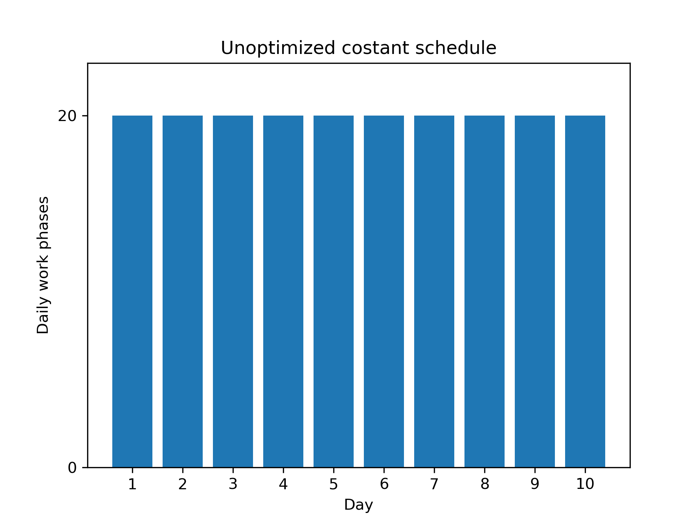
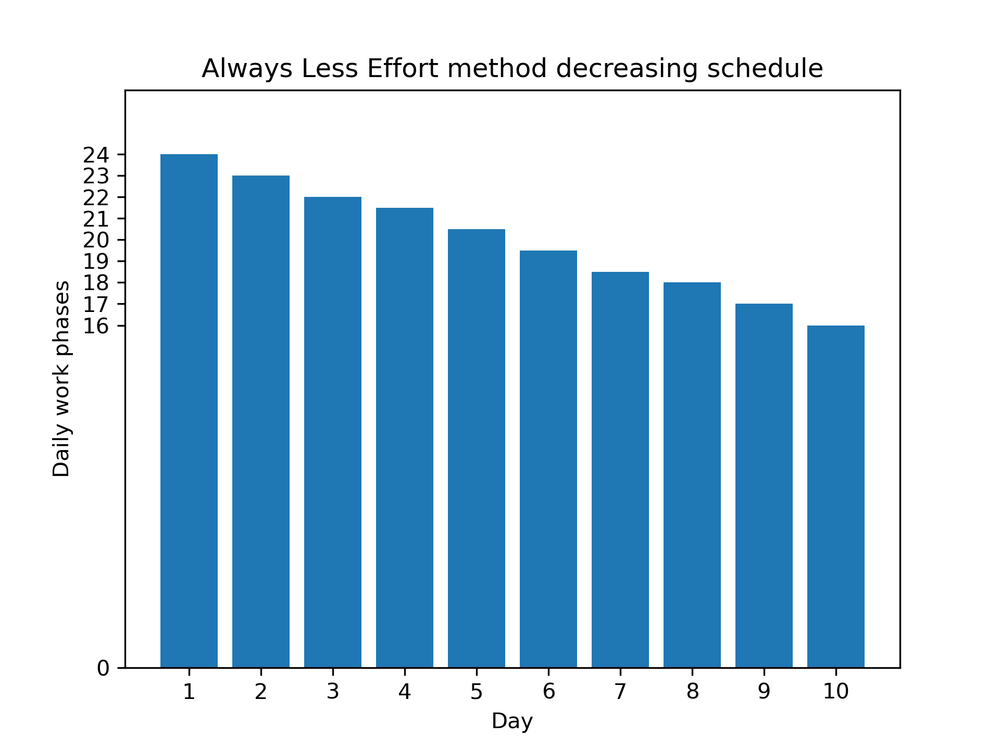

# Always-Less-Effort
Always Less Effort (ALE) is a scheduling algorithm that distributes a fixed workload before a given deadline so that each day requires less work than the previous one, while still guaranteeing completion of the total workload. The ratio between the first-day and last-day workloads is user-defined, and the daily workload distribution is obtained in a single computation through a closed-form analytical solution.

Copyright 2026 Samuel Bresciani bresciani.app@gmail.com

## What is it

Tasks frequently require daily progress, which can lead to cumulative fatigue or cognitive overload. This can happen due to either the overall scope of the project or the inherent nature of the process,
which may include multiple review and validation phases that become increasingly complex over time. Consequently, this situation typically leads to a scenario where the workload in the final days, 
close to the deadline, is significantly heavier compared to the first days.

The purpose of the Always-Less-Effort method is to organize the daily work in a user-controlled, decreasing manner instead of using a constant schedule. Through a personalized parameter, the method allows
the user to allocate more work to the first days and less to the final days close to the deadline. 
This ensures that the end of the process is reached with more time available to manage the cumulative results of previous days and any unforeseen obstacles. 

In terms of computational speed, an important advantage of using this method is that the parameters are computed only once in a single iteration, thanks to an analytical solution. They are not deduced through an iterative process, as 
other algorithms might do. This is possible due to the exact calculation of the trend parameters, as illustrated in the [How to use](https://github.com/BrescianiS/AlwaysLessEffort_method?tab=readme-ov-file#how-to-use) section
and mathematically explained in the [Analytical solution derivation](https://github.com/BrescianiS/AlwaysLessEffort_method?tab=readme-ov-file#analytical-solution-derivation) section.

## Generic example
Consider a hypothetical production process for a final product that requires either intermediate validation steps (to verify the results obtained up to that point) or a comprehensive final phase. In this scenario,
the objective is to prevent a cumulative workload spike near the deadline, or at the very least, to optimally manage cases where a failed quality check requires preceding steps to be repeated.

Therefore, assuming a process with a total of 200 phases and a deadline of 10 days, a constant daily workload would result in a schedule of 20 phases per day.

| Day | Daily work phases  |
|:----|:------------------:|
| 1   |         20         |
| 2   |         20         |
| 3   |         20         |
| 4   |         20         |
| 5   |         20         |
| 6   |         20         |
| 7   |         20         |
| 8   |         20         |
| 9   |         20         |
| 10  |         20         |

In contrast, by applying the _Always-Less-Effort method_ and setting the input workload ratio parameter to **50** (representing a 50% higher workload on the first day compared to the last), the number of available 
days to **10**, and the overall workload to **200** generic phases, a decreasing schedule is obtained. This schedule still distributes 
all 200 phases across 10 days but accounts for the desired initial workload increment, determined by the ratio between the first and last day.  
The optimal value for this ratio can be determined based on personal experience regarding how much more demanding the final phases of a process might be compared to the initial ones. Alternatively, it can be used as a strategy
to free up time during the final days, making it easier to handle the overall production process, quality checks, or reviews.
(For an illustration of the algorithm's usage, see the [How to use](https://github.com/BrescianiS/AlwaysLessEffort_method?tab=readme-ov-file#how-to-use) section)

| Day | Daily work phases  |    Approximated value of daily work phases    |
|:----|:------------------:|:---------------------------------------------:|
| 1   |         24         |                      24                       |
| 2   |       23.11        |                      23                       |
| 3   |       22.22        |                      22                       |
| 4   |       21.33        |                     21.5                      |
| 5   |       20.44        |                     20.5                      |
| 6   |       19.56        |                     19.5                      |
| 7   |       18.67        |                     18.5                      |
| 8   |       17.78        |                      18                       |
| 9   |       16.89        |                      17                       |
| 10  |         16         |                      16                       |

To ensure the consistency of the method, the sum of the daily phases obviously equals the overall workload of 200 phases.

Approximated (rounded) values for the daily phases are also computed, and these are verified to ensure consistency with the 200 total phases (i.e., the sum of the column values must equal the input goal of 200). In the specific case where
the sum of the approximated values does not exactly match the overall workload, the user is alerted in the output via a specific warning parameter.

## Areas of application
In every context where daily activities become increasingly complex due to their cumulative nature, or simply 
because they build upon progress made in previous days, this method can be applied.
Here, two possible examples are illustrated:

- In a corporate environment, professionals, whether managing individual tasks or overseeing subordinates, frequently need to structure workflows
around specific deadlines. When the final output depends on the integration of all cumulative results from previous activities, continuous testing and validation are required.
This dynamic inevitably shifts the core complexity and workload toward the final days of the project, increasing stress and the risk of failure near the deadline.  
Implementing a controlled, linear-decreasing schedule ensures sufficient buffer time in the final days to perform final checks and mitigate unexpected contingencies.

- In an educational context, this method can significantly optimize study material organization. A student can map the total number of pages required for an exam directly to the overall workload parameter (e.g., 200 pages instead of 200 work phases).
Generally, when preparing for an exam, the initial material (e.g., the first 10 pages) is often significantly easier to digest than the same volume of content encountered in the final stages. This disparity exists because advanced core
concepts rely heavily on foundational knowledge progressively acquired over time. Consequently, a simple, constant study schedule of 10 pages per day can make the final days much harder.  
In contrast, by implementing the controlled, linear-decreasing method, students can tailor their schedule to assign fewer pages to the final days, by adjusting the input parameter based on the subject's complexity.
In this way students can prevent a late-stage workload accumulation, mitigate academic stress, and approach the final examination with a more rested mind.  
That is how the method was originally conceived and efficiently applied during Bachelor's and Master's degree studies.  
To support this practical application, a free and lightweight mobile **app** named [StudySprint](https://github.com/BrescianiS/AlwaysLessEffort_method#studysprint-mobile-free-app) is officially available on the Google Play Store. The application assists students with advanced features, including the ability to dynamically update and recalibrate their schedules if they fall behind on academic deadlines.

You have to consider that, in every situation, reducing the workload (or study) in the final days inevitably implies increasing it during the first days, due to the obvious necessity of completing the total 
workload (or study material); and this aspect can be managed thanks to the designated parameter representing the ratio between the workload (or study) of the first day compared to the last day.

## How to use
The scripts are written in C++17.  
It is sufficient to execute the _main_ function to obtain an example of the potential usage of the algorithm.

The algorithm parameters refer to the case where we consider the number of phases of a production process as the concept of overall workload, but it can obviously be directly used for any area
of application required, simply by quantifying the overall workload through the parameter _nPhases_.

The input parameters of the algorithm are:
- **nPhases**: the number of phases required to obtain the final product
- **nDays**: the number of available days before the deadline
- **desiredRate**: the desired workload increase, expressed as a percentage, of the first day compared to the last day.

(The underlying mathematical logic is illustrated in the section [Main parameters of the single-iteration algorithm solution](https://github.com/BrescianiS/AlwaysLessEffort_method#main-parameters-of-the-single-iteration-algorithm-solution))  
Decimal numbers of days can be entered as well (e.g. 12.3); in this case, the algorithm will organize the computation, as well as the output text, managing everything in terms of half-days.  
The optimal value of the rate parameter _desiredRate_ can be deduced as illustrated in the [generic example](https://github.com/BrescianiS/AlwaysLessEffort_method#generic-example), based on experience regarding how much more difficult the final phases could be compared to the initial ones.

Additional input parameters can be set for the precision of the algorithm in checking how close the computed values are to the analytical solution, as well as for the rounding of written
output text values. These out-of-precision cases are very rare situations, but their self-correction has been included for completeness (their functionality is illustrated in the [Self-correction procedure](https://github.com/BrescianiS/AlwaysLessEffort_method#self-correction-procedure) section).

The repository consists of two libraries:
- **_AlwaysLessEffort_**: elaborating the actual algorithm on which the method is based
- **_TextCreator_**: generating the output text content with all information regarding the achieved results

Both are called in the _main_ function as a practical example.  
The output values of _AlwaysLessEffort_ comprise all the computed values of the algorithm and any potential warnings.
The _TextCreator_ class takes an AlwaysLessEffort class variable and additional output rounding parameters as input, and then it generates the string for the content of the output text file.  
An [example of the final text file](https://github.com/BrescianiS/AlwaysLessEffort_method/blob/main/SCHEDULE_i450_p26750_d127_en.txt) resulting from the overall elaboration is included in the repository files. 

## Analytical logic

### Main parameters of the single-iteration algorithm solution
An important advantage of this method, in terms of computational speed, is that its parameters are computed analytically in an exact way within a single computation, rather than being obtained through multiple converging iterations as seen in other algorithms.
This is possible due to an analytical solution to the problem, as demonstrated in the [Analytical solution derivation](https://github.com/BrescianiS/AlwaysLessEffort_method?tab=readme-ov-file#analytical-solution-derivation) section, which has led to the parameters illustrated in this section.

The daily workload distribution is computed as follows:  
defining $R$ as the previously introduced ratio between the 'quantity' of work to be performed on the first day and on the last day,  
a daily workload distribution (expressed here in terms of work phases) can be defined as $p(d) = q - m d$, where $p(d)$ is the number of work phases to be performed on day $d$. In this equation, $m$ and $q$ are two positively defined parameters, analytically computed as a function of the total available days $N$ (e.g. 10 days in the [generic example](https://github.com/BrescianiS/AlwaysLessEffort_method?tab=readme-ov-file#generic-example))
and the overall workload to be completed $P$ (e.g. 200 total work phases in the [generic example](https://github.com/BrescianiS/AlwaysLessEffort_method?tab=readme-ov-file#generic-example)).

The two main algorithm parameters are:

$q = \frac{2 P R}{ N ( R +1) } $

$m = q \frac{ R -1}{ R (N - 1) }$

Hence, once _q_ and _m_ are computed as a function of the input parameters (_P_, _N_ and _R_), the number of phases $p(d)$ to be completed on day $d$ can be easily obtained as $p(d) = q - m d$.  
Please note that the day index _d_ ranges from 0 up to _N-1_.  
Alternatively, we can first compute the number of phases for the first day, $p(0)$, which is exactly $q$; all subsequent daily workload values can then be easily obtained as a function of the previous day's value as $p(d) = p(d-1) - m$. 

The derivation of these formulas and corresponding mathematical proofs are all illustrated in [Analytical solution derivation](https://github.com/BrescianiS/AlwaysLessEffort_method?tab=readme-ov-file#analytical-solution-derivation).

### Self-correction procedure
For the sake of completeness, the self-correction procedure has been formulated for cases where some of the obtained results 
depart from the requested values due to the computational precision limitations. This is verified using default precision parameters, which can also be adjusted as input secondary parameters for _AlwaysLessEffort_.

If the ratio between the computed phases of the first and last day ( $p(0) / p(N-1)$ ) deviates from the desired value ( _desiredRate_, represented as _R_ in the formulas ) by more than the precision threshold ( default: 0.0001 $\equiv$ 0.01% of increase ),
or if the sum of the computed phases $p(d)$ is not sufficiently close to the input value ( _nPhases_, represented as _P_ in the formulas ) based on the precision criteria ( default: 0.01 phases ),
a self-correction procedure is triggered. This procedure modifies the values of parameters $q$ and $m$, rescaling them as a function of the desired overall work _P_.  

The procedure operates as follows: initially, _m_ is scaled as a function of the ratio between the desired and obtained _P_  
( $m^{'} = m \frac{P}{P^* }$ where _m'_ is the updated _m_ and _P*_ is the sum of all currently obtained phases $p(d)$ )  
and _q_ is computed using the linear equation that relates _m_ and _q_ as a function of _P_ and _N_  
( $q^{'} = \frac{ P + m^{'} (N (N-1)/2) }{N}$ where _q'_ is the updated _q_ );  
then, if the resulting ratio _R_ ( $R^{'} = \frac{q^{'} }{q^{'} - m^{'} (N-1)}$ ) falls within an acceptable range ( specifically, near the desired _R_ within twice the precision threshold), 
the updated _m_ and _q_ values are accepted and the standard scheduling computation can then restart from day 0 with new corrected _m_ and _q_ parameters; otherwise, the correction procedure is rejected and the execution terminates.  
Under this logic, correcting the total number of phases $P$ takes priority over correcting the ratio $R$.  
If the final values of $P$ or $R$ still deviate from the target values at the end of the scheduling computation, this self-correction process can be repeated iteratively. The maximum number of iterations is defined by a secondary parameter (default: 2).

### Analytical solution derivation
A decreasing linear trend has been considered for the scheduling. Therefore, naming the number of phases to be completed on day $d$ as $p(d)$,
the workload on the first day ( that corresponds to $d = 0$ ) is exactly $q$, as derived from the linear equation $p(d) = q - m d$.
Consequently, since the schedule begins at $d = 0$, the last available day considered by the algorithm is $d = N - 1$, due to the fact they are a total of $N$ days.

Considering the overall work to be completed, named $P$, as the sum of all daily workloads $p(d)$:  
$P = \sum_{d=0}^{N -1} p(d) = p(0) + p(1) + ... + p(N-1) = q + \sum_{d=1}^{N -1} p(d)$  
where the workload for each day decreases by a constant value _m_ compared to the previous one, from day $0$ to $N - 1$, so  
$P = q + (q-m) + ( q -m -m) + ( q -m -m -m) + ... + (q - m(N-1))$
$= N q - m \sum_{d=1}^{N-1} d = N q - m \frac{N (N-1)}{2} $

The ratio $R$ between the first-day and last-day workload can be computed as  
$R = \frac{p(0)}{p(N-1)} = \frac{q}{ q - m(N-1)}$ , with _R_ > 1 by definition, consistent with the scope of the algorithm.

Therefore, two equations are obtained to relate $P$, $R$ and $N$ to $m$ and $q$:

$P = N q - m \frac{N (N-1)}{2} $  
$R = \frac{q}{ q - m(N-1)}$

Considering that the values of $N$, $R$ and $P$ are known as they are defined as input parameters, we can analytically solve for $q$ and $m$:

$q = \frac{P/N}{1 - (1/2) (1 - 1/R)}  = \frac{2 P R}{ N ( R +1) }  $  
$m = q \frac{ 1 - 1/R}{ N - 1} = q \frac{ R -1}{ R (N - 1) } = \frac{2 P (R -1)}{ N (N-1) ( R +1) } $.

Through this approach, the daily schedule is computed in an analytically exact manner without relying on iterative approximation methods, while simultaneously simplifying
the management of the overall workload before the deadline, fully respecting user-defined parameters.

The core logic of the algorithm could be generalized to any context involving a non-linear trend, provided that it can be expressed in a continuous form that leads to an analytically exact solution.  
For instance, a second-degree polynomial trend could be adopted; however, since the model would rely on three input parameters, additional constraints or boundary conditions should be considered.
Following the same approach described above, with a realistic second-degree decreasing function ( $p(d) = -a d^{2} - b d + c$ ), the following relations can be derived:  
$P = N c - b \frac{N(N-1)}{2} - a \frac{N( N-1)(2N -1)}{6}$  
$R = c /( -a (N-1)^2 - b (N-1) + c) $  
Nevertheless, an additional equation is necessary to uniquely determine the coefficients $a$, $b$ and $c$.  
This methodology could potentially be extended to higher-degree polynomials as well, but further practical considerations would need to be tailored to specific use cases.
Similarly, if an iterative root-finding process was used, the schedule could be computed for almost any non-uniform trend.
However, this would obviously sacrifice the computational efficiency of an analytically exact formulation, which requires no convergence iterations and yields a precise solution, as is the case with this method. 

## StudySprint mobile free app

If you want to apply this scheduling method to your academic routine without manual calculations, you can use StudySprint. This free and lightweight mobile application automates the algorithm, helping you manage exam preparation efficiently.

- Custom Constraint: Tailor the workload ratio based on the subject's complexity and your personal needs
- Study Window Calculator: Automatically computes your available study days by accounting for your days off and final review period
- Dynamic Schedule Updates: If you fall behind or miss a daily goal, the app effortlessly recalibrates and redistributes the remaining workload
- Multi-exam Management: Balance multiple subjects simultaneously with dedicated, independent study plans
- 100% Offline and Private: Operates entirely without internet access, so zero ads, no data tracking, and complete privacy
- Lightweight and Fast: At under 15 MB, the app runs fast and efficiently thanks to a clean, proprietary algorithm with no heavy AI overhead
- PDF Export: Save and export your dynamic schedule details directly to a PDF

    
( Or visit the website [getstudysprint.com](https://getstudysprint.com/) )
